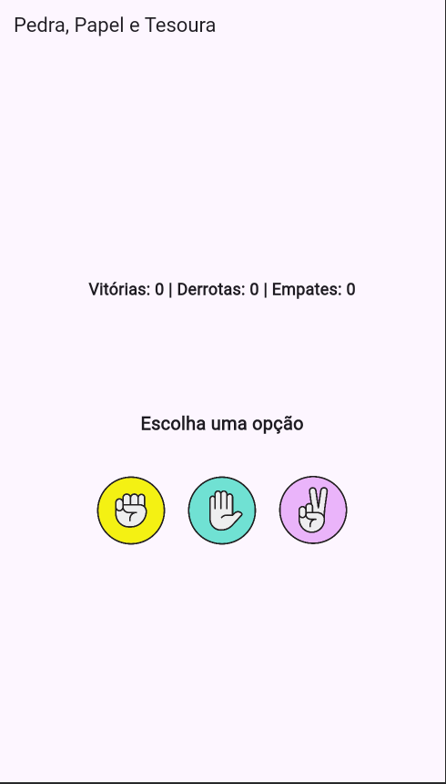

# Pedra, Papel e Tesoura - Flutter

## 📌 Sobre o Projeto
Este é um jogo de **Pedra, Papel e Tesoura** desenvolvido em **Flutter**. O jogador escolhe uma opção e compete contra o aplicativo, que seleciona aleatoriamente sua jogada. O jogo exibe o placar de vitórias, derrotas e empates, além de mostrar as escolhas dos participantes por meio de imagens.

## 🎓 Matrícula dos Desenvolvedores
- **Matheus Cordeiro** - 22217014
- **Vitor Saar** - 122100011

## 🚀 Tecnologias Utilizadas
- **Flutter** (Dart)
- **Material Design** para UI
- **Random()** para escolha aleatória do app

## 🎮 Funcionalidades
- Escolha entre **Pedra, Papel ou Tesoura**
- O app escolhe aleatoriamente uma opção
- Exibição do placar com vitórias, derrotas e empates
- Interface gráfica com imagens representando as escolhas
- Sistema de pontuação atualizado automaticamente

## 📸 Capturas de Tela


## 🛠 Como Executar o Projeto
1. **Clone este repositório**
   ```sh
   git clone https://github.com/MatheusMoon/PedraPapel-Tesoura_Flutter.git
   ```
2. **Acesse o diretório**
   ```sh
   cd PedraPapel-Tesoura_Flutter
   ```
3. **Instale as dependências**
   ```sh
   flutter pub get
   ```
4. **Execute o aplicativo**
   ```sh
   flutter run
   ```

## 📂 Estrutura do Projeto
```
/lib
│-- main.dart        # Código principal do app
│-- assets/images/   # Imagens usadas no jogo (pedra, papel, tesoura)
```

## 🔗 Contribuição
Contribuições são bem-vindas! Sinta-se à vontade para abrir issues e pull requests.

## 📄 Licença
Este projeto está sob a licença MIT - veja o arquivo [LICENSE](LICENSE) para mais detalhes.

---
📌 **Desenvolvido por [MatheusMoon](https://github.com/MatheusMoon) e Vitor Saar** 🚀

